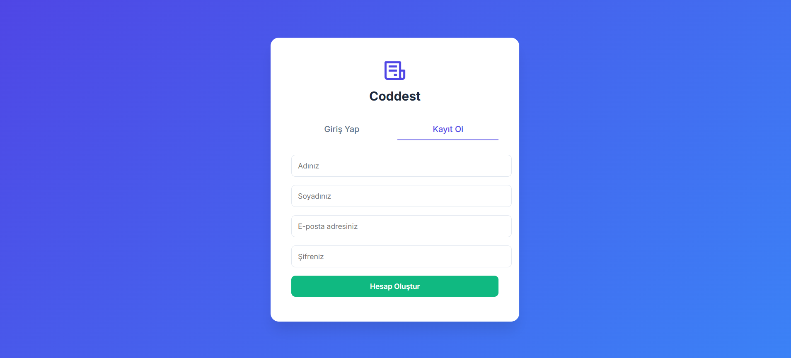
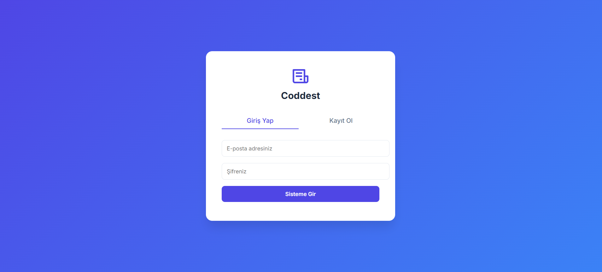
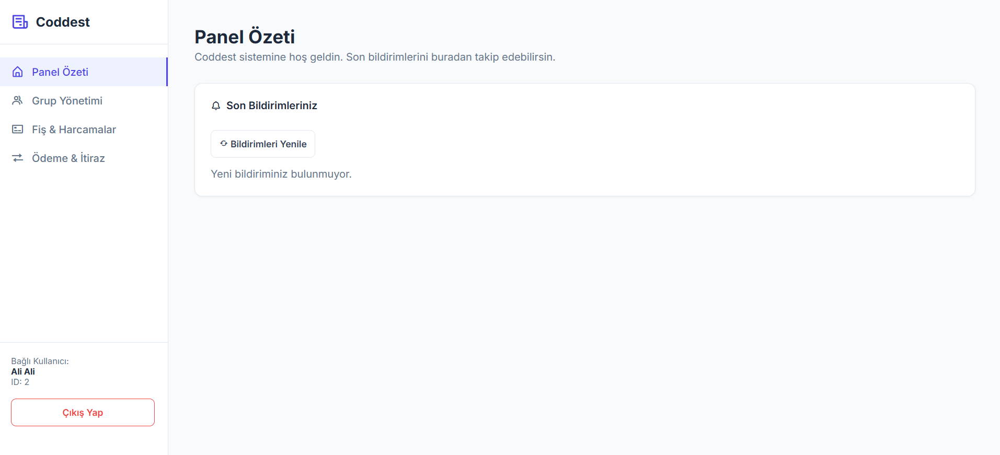
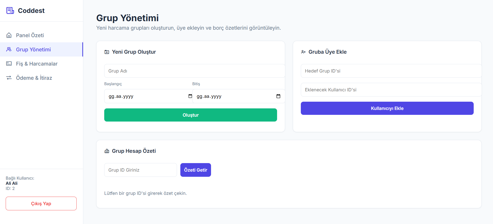
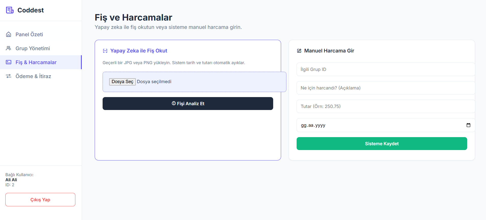
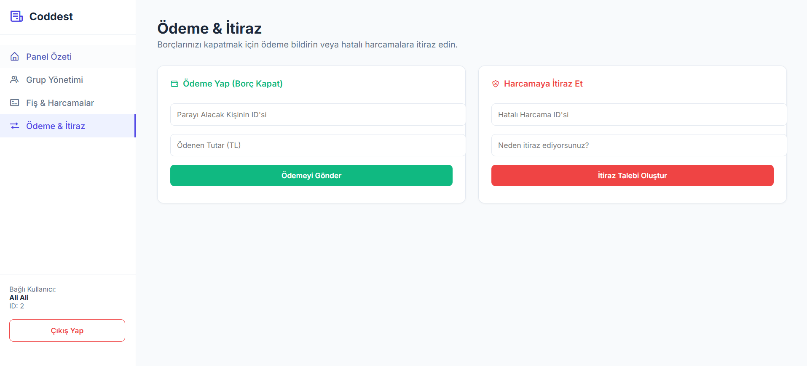

# CODDEST - Akıllı Fiş Okuma ve Grup Gider Paylaşım Platformu

## Proje Açıklaması ve Amacı
Günümüzde bireyler, özellikle ortak yaşam alanlarında (öğrenci evleri, yurtlar), seyahatlerde veya ekip çalışması gerektiren organizasyonlarda sıkça ortak harcamalar gerçekleştirmektedir. Bu harcamaların adil bir şekilde paylaştırılması, borç ve alacak ilişkilerinin doğru biçimde hesaplanması ve takip edilmesi, geleneksel yöntemlerle oldukça karmaşık ve hata yapmaya açık bir süreçtir.

Bu proje kapsamında geliştirilen **Akıllı Fiş Okuma ve Grup Gider Paylaşım Platformu (CODDEST)**, bu problemlere yenilikçi ve otomatik bir çözüm sunmayı amaçlayan bir yazılım sistemidir. Sistem, yüklenen fiş görsellerini Optik Karakter Tanıma (OCR) teknolojisi ile analiz ederek temel bilgileri otomatik çıkarır ve grup içi harcamaları akıllı bir şekilde paylaştırır.

**Temel Hedefler:**
* Ortak harcamaların sisteme hızlı ve hatasız şekilde aktarılmasını sağlamak.
* Manuel veri girişini minimuma indirerek kullanıcı deneyimini artırmak.
* Borç ilişkilerini analiz eden **borç sadeleştirme algoritması** ile gereksiz ödeme zincirlerini ortadan kaldırmak.
* Güvenli, ölçeklenebilir ve yüksek performanslı bir sistem sunmak.

## Özellikler
* **Yapay Zeka Destekli OCR:** Fiş fotoğraflarından tarih, satıcı adı ve toplam tutar gibi bilgilerin Tesseract OCR ile otomatik algılanması.
* **Akıllı Borç Paylaşımı ve Sadeleştirme:** Karmaşık borç ağlarını en optimize ödeme planına dönüştüren gelişmiş hesaplama algoritması.
* **Güvenli Kimlik Doğrulama:** JWT (JSON Web Token) ve Bcrypt ile şifrelenmiş, yetkilendirme tabanlı güvenli kullanıcı altyapısı.
* **Etkileşimli API Dokümantasyonu:** Swagger UI üzerinden tüm uç noktaların (endpoints) test edilebilmesi.
* **Kullanıcı Dostu Web Arayüzü:** FastAPI StaticFiles ile sunulan entegre HTML/CSS yönetim paneli.

## Kullanılan Teknolojiler

**1. Arka Uç (Backend) Teknolojileri**
* **Python (v3.12):** Ana programlama dili.
* **FastAPI:** Yüksek performanslı, modern ve asenkron RESTful web framework.
* **Uvicorn:** FastAPI uygulamasını sunan yüksek performanslı ASGI web sunucusu.

**2. Veri Yönetimi ve Veritabanı**
* **SQLite:** Geliştirme süreci için hafif ve taşınabilir ilişkisel veritabanı.
* **SQLAlchemy (ORM):** Veritabanı işlemlerini Python nesneleri ile yöneten, SQL Injection riskini önleyen köprü.
* **Pydantic:** Gelen ve giden verilerin doğruluğunu kontrol eden veri doğrulama kütüphanesi.

**3. Güvenlik ve Kimlik Doğrulama**
* **JWT (python-jose):** Stateless mimari için kriptografik oturum yönetimi.
* **Bcrypt (passlib):** Kullanıcı şifrelerinin tek yönlü olarak güvenli şekilde hashlenmesi.
* **OAuth2:** Modern web standartlarına uygun kimlik doğrulama şeması.

**4. Yapay Zeka ve Veri İşleme**
* **Tesseract OCR (pytesseract):** Fiş görsellerini dijital metne çeviren açık kaynaklı optik karakter tanıma motoru.
* **Pillow (PIL):** Tesseract öncesi görsel işleme ve optimizasyon kütüphanesi.
* **python-multipart:** Dosya ve fotoğraf yükleme işlemleri için form işleme aracı.

## Klasör Yapısı
```text
Kostu-dev-OCR-Projesi/
├── dokümanlar/         # Dokümantasyon dosyaları
├── gorseller/          # Proje ekran görüntüleri
├── auth.py             # Kimlik doğrulama ve JWT işlemleri
├── database.py         # Veritabanı bağlantı konfigürasyonları
├── index.html          # Frontend web arayüzü dosyası
├── main.py             # FastAPI ana uygulama ve endpoint yönlendirmeleri
├── models.py           # SQLAlchemy veritabanı tabloları/modelleri
├── ocr_service.py      # Tesseract OCR yapay zeka analiz servisleri
├── schemas.py          # Pydantic veri doğrulama şemaları
├── requirements.txt    # Proje bağımlılıkları ve kütüphane listesi
├── .gitignore          # Git takibinden çıkarılan dosyaların listesi
└── README.md           # Proje dokümantasyonu
```

## Kurulum Ve Çalıştırma Adımları

Kurulum Öncesi Gereksinimler:

Bilgisayarınızda Python 3.8 veya üzeri yüklü olmalıdır.

OCR motoru için Tesseract OCR kurulu olmalıdır. Kurarken dil paketleri kısmında Türkçe'yi işaretleyiniz. (Windows için kurulum sonrası C:\Program Files\Tesseract-OCR\tesseract.exe yolunun doğru ayarlandığından emin olun).

##  Eğer "Failed loading language 'tur' Tesseract couldn't load any languages! Could not initialize tesseract." Hatası Alırsanız Çözümü(Hatayı almazsanız gerek yok):

Tesseract içinde Türkçe dil paketi kurulu olmalı, hatanın sebebi o.
https://github.com/tesseract-ocr/tessdata/blob/main/tur.traineddata dosyasını indirin.
Bunu indirdikten sonra tessdata'ya atın.

## Çalıştırma Adımları:

Sanal Ortam Oluşturun: Terminali açın, projenin bulunduğu klasöre gidin ve aşağıdaki komutu çalıştırın:

Bash
python -m venv venv
Sanal Ortamı Aktif Edin:

Windows için: .\venv\Scripts\activate

Mac/Linux için: source venv/bin/activate

## Gerekli Kütüphaneleri Kurun:

Bash
pip install -r requirements.txt
Sunucuyu Başlatın:

Bash
python main.py
(Sunucu başlatıldığı anda proje web arayüzü http://127.0.0.1:8000/arayuz adresinde otomatik olarak açılacaktır. API dokümantasyonunu teknik düzeyde incelemek isterseniz http://127.0.0.1:8000/docs adresini ziyaret edebilirsiniz.)

## Ekran Görüntüleri















## Geliştirme Önerileri

Kapsamlı Dil ve Format Desteği: OCR motorunun farklı dillerdeki ve buruşuk/hasarlı fiş formatlarındaki başarı oranını artırmak için makine öğrenimi modelleri ile eğitilmesi.

Finansal Entegrasyon: Banka API'leri (Açık Bankacılık) ve IBAN entegrasyonu ile borçların sistem üzerinden doğrudan transfer edilebilmesi.

Mobil Uygulama: Mevcut API altyapısı kullanılarak React Native veya Flutter ile native bir mobil uygulamanın geliştirilmesi.

Katkıda Bulunanlar

Yiğit Atik 220501041
Ömer Çağlar Çetintaş 230501025
Ataol Ali Topal 220501029
Ahmet Melih Bıçakçı 230501021


